# ESG-Oriented-Microalgae-PV-LCA-System-for-Renewable-Biofuel-includes-GenAI

```mermaid
flowchart LR
  %% === Physical / Process ===
  subgraph PROC[Process: Microalgae → Fuel/SAF]
    PR1[Pretreatment / Disruption]
    PR2[Phase Separation]
    PR3[Distillation / Upgrading]
    PR4[Membrane & Dewatering]
    PR1 --> PR2 --> PR3 --> PR4
  end

  %% === PV / Energy ===
  subgraph PV[PV / Energy System]
    PV1[PV Modules]
    PV2[Combiner Box]
    PV3[Hybrid Inverter<br/>Grid / Battery / Load]
    PV1 --> PV2 --> PV3
  end

  %% === Monitoring (independent, also used by GenAI) ===
  subgraph MON[Monitoring Layer]
    SENS[Process / Power / Env Sensors]
    EDGE[Edge Gateway<br/>MQTT / OPC-UA]
    QCHECK[Data Quality<br/>units • ts • gaps • flags]
    SENS --> EDGE --> QCHECK
  end

  %% === Data Platform ===
  subgraph DP[Database / Data Platform]
    INGEST[Ingestion]
    RAW[Raw Zone]
    STG[Staging / ETL]
    WH[Warehouse / Data Marts]
    FEAT[Feature Store]
    RES[Results: LCIA • Predictions • Reports]
    INGEST --> RAW --> STG --> WH
    WH --> FEAT
    WH --> RES
  end

  %% === LCA System ===
  subgraph LCA[LCA System]
    L1[LCI]
    L2[LCIA: ReCiPe / GWP / CED]
    L3[Interpretation]
    L1 --> L2 --> L3
  end

  %% === AI Layer ===
  subgraph AI[AI Layer]
    GENAI[GenAI<br/>CRUD • reporting • SOP/Q&A • fault guide]
    RLHF[RLHF feedback]
    ML[ML/DL<br/>LSTM • CNN • Transformer • TabNet • RL]
    RLHF --> GENAI
  end

  %% === Apps ===
  APP[Dashboards / API / Webhooks]

  %% === Flows ===
  %% Monitoring feeds the platform
  QCHECK --> INGEST

  %% Process & PV -> Monitoring sensors
  PR1 -.data.-> SENS
  PR2 -.data.-> SENS
  PR3 -.data.-> SENS
  PR4 -.data.-> SENS
  PV3 -.power/env.-> SENS

  %% LCA and AI consume platform data
  WH --> L1
  FEAT --> ML --> RES
  WH --> GENAI --> RES

  %% Monitoring knowledge used by GenAI (diagnostics / training)
  MON <-- uses / augments --> GENAI

  %% LCA results persist
  L3 --> RES

  %% Expose to apps
  WH --> APP
  RES --> APP


```

## System Overview

This system integrates **Microalgae Process**, **PV/Energy System**, **Life Cycle Assessment (LCA) System**, **Database Platform**, and **GenAI System** into a unified architecture.

- **Process**: Converts microalgae biomass into fuel-grade oil and by-products.  
- **PV/Energy System**: Supplies electricity to the process and infrastructure, while enabling energy monitoring.  
- **LCA System**: Quantifies environmental impacts across all stages, generating key sustainability indicators.  
- **Database Platform**: Collects, normalizes, and manages time-series data, inventory records, and results.  
- **GenAI System**: Connects all layers, supporting queries, explanations, automated reporting, and fault guidance.  

# System Architecture Details

## Process (Microalgae → Fuel/SAF)

**Role**  
Convert wet microalgae biomass into fuel-grade algal oil and recover by-products.

**Inputs / Outputs**  
- Inputs: biomass slurry, water, enzymes/chemicals, heat, electricity.  
- Outputs: fuel-grade algal oil (distillate fractions), impurities (salts, metals, phosphorus, chloride), algal cake, recyclable water.  

**Monitored Parameters**  
- Cell disruption: motor load, pH, conductivity.  
- Phase separation: interface level, flow rates.  
- Distillation: tray/packing temperatures, tower pressure, reflux ratio, product composition.  
- Membrane/filtration: transmembrane pressure, flux, turbidity, pump power.

**Database Tables**  
- `fact_process_timeseries` – process sensors (P/T/F/quality).  
- `fact_material_flow` – material/energy flows.  
- `dim_process_step`, `dim_equipment`.  

**KPIs**  
Conversion yield, specific energy use (kWh/MJ), distillation energy demand, membrane flux, water reuse rate.

---

## PV / Energy System

**Role**  
Hybrid PV supply with battery and grid interface.

**Flow**  
PV modules → combiner box → hybrid inverter → load / battery / grid.

**Measurements**  
String voltages/currents, inverter AC power, battery SoC, grid import/export, irradiance, module temperature.

**Database Tables**  
- `fact_energy_timeseries` – PV, grid, battery, load.  
- `fact_pv_allocation` – PV share (α), grid share, battery losses.  
- `dim_string`, `dim_inverter`, `dim_meter`, `dim_envsensor`.  

**KPIs**  
Performance ratio (PR), PV fraction α, self-consumption, self-sufficiency, battery roundtrip efficiency, inverter efficiency.

---

## LCA System

**Role**  
Life cycle evaluation of the algal oil pathway.

**Scope**  
System boundary: pretreatment, separation, distillation, residue treatment, energy supply.  
Functional unit: 1 MJ fuel-grade algal oil.  

**Inventory (LCI)**  
- Inputs from process (energy, chemicals, water, materials).  
- Background data (emission factors, material/energy production).  

**Impact Assessment (LCIA)**  
- Indicators: GWP, CED, ecotoxicity, acidification/eutrophication, EPBT/EROI.  
- Scenarios: PV share α, heat source (gas/electric/steam), H₂ origin (grey/green), water reuse fraction.  

**Database Tables**  
- `fact_runs` – boundary, method, scenario.  
- `fact_lci` – inventory results.  
- `fact_lcia` – impact results.  

**Outputs**  
Hotspot breakdowns, sensitivity tornado charts, Monte Carlo uncertainty ranges.

---

## Database / Data Platform

**Layers**  
- **Ingestion** – APIs, MQTT, OPC-UA.  
- **Raw zone** – append-only time series.  
- **Staging / ETL** – unit normalization, time alignment, anomaly flags.  
- **Warehouse / Data marts** – star schema (facts/dims).  
- **Feature Store** – windowed features, lag stats, environmental joins.  
- **Results** – LCIA, predictions, reports.  
- **Access** – views, APIs.  

**Core Fact Tables**  
- `fact_process_timeseries`, `fact_energy_timeseries`, `fact_material_flow`, `fact_pv_allocation`, `fact_lci`, `fact_lcia`, `pred_pv_power`, `events_alarms`.  

**Dimension Tables**  
- `dim_equipment`, `dim_point`, `dim_process_step`, `dim_emission_factor`, `dim_method`.

---

## GenAI System

**Functions**  
- CRUD queries: NL → SQL for tables/plots.  
- Reporting: structured LCA/energy/process reports.  
- SOP/Q&A: retrieve standards and manuals (RAG).  
- Fault guide: diagnostics + repair steps from monitoring data.  
- Training: convert events into training modules.

**Models**  
- Current: LSTM (time-series prediction), CNN (image/quality detection).  
- Attribution: weather, pollution, maintenance logs → cause analysis.  
- Future: Transformer, TabNet, RL for optimization.  
- RLHF: operator feedback loop to refine outputs.

**Data Interface**  
- **Read**: `Warehouse`, `Feature Store`, `Results`.  
- **Write**: `Results` (reports, interpretations, tasks).  
- **Bidirectional**: link with Monitoring for alarms and diagnostics.

**KPIs**  
Prediction accuracy, explanation relevance, maintenance efficiency, training adoption.

# Microalgae Oil Conversion and By-product Processing

## Pretreatment & Cell Disruption
Microalgae undergo enzymatic treatment or mechanical disruption to break cell walls, releasing intracellular lipids and soluble organic matter. The resulting algal suspension serves as the raw material for downstream separation.

## Primary Separation
Through a phase separation unit, the mixture is divided into **crude algal oil** and **aqueous algal residue**.  
This step establishes the basis for subsequent oil refinement and by-product recovery.

## Algal Oil Refinement
Crude algal oil enters a distillation column, where it is further separated into **fuel-grade algal oil** and **non-target impurities**.  
- **Fuel-grade algal oil** can be used directly as biodiesel or as feedstock for catalytic upgrading.  
- **Impurities** are collected separately for treatment or reuse.  

## Residue and Water Treatment
- The aqueous residue undergoes **cross-flow or tubular membrane separation**, producing concentrated algal slurry.  
- The slurry is further dewatered using **plate-frame filtration**, yielding solid algal biomass suitable for use as feed, fertilizer, or fermentation substrate.  
- Membrane separation simultaneously generates **recyclable water**, part of which is returned to the cultivation pond to minimize external water demand and establish a closed-loop cycle.  

## Resource Recovery & Circular Utilization
- **Main product**: Fuel-grade algal oil (renewable energy).  
- **By-products**: Algal biomass (agricultural/industrial use), impurities (by-product management), recyclable water (returned to the pond).  

This closed-loop pathway enables both energy recovery and by-product valorization, aligning with **sustainability** and **circular economy** principles.  

---

# Life Cycle Assessment (LCA) of the Algal Oil Conversion System

## 1. Goal and Scope Definition
- **Goal**: To evaluate the environmental impacts of the algal oil production pathway from cultivation to fuel conversion.  
- **System boundary**: Covers pretreatment (disruption), separation, oil refinement, by-product handling, and water recycling.  
- **Functional unit**: Defined as **1 MJ of usable fuel-grade algal oil**.  

## 2. Life Cycle Inventory (LCI)
Collection of energy and material flow data across all stages:  
- **Pretreatment & Disruption**: Electricity, enzyme, or chemical inputs; release of intracellular materials.  
- **Primary Separation**: Energy consumption of separation units; output flows of crude oil and aqueous residue.  
- **Oil Refinement**: Heat demand of distillation; output of fuel oil and impurities.  
- **Residue & Water Treatment**: Energy demand of membrane separation and filtration; outputs of concentrated slurry, solid biomass, and recyclable water.  
- **By-product flows**: Quantities of impurities, wastewater, and biomass; reuse ratios and disposal pathways.  

Data sources include on-site monitoring (energy, water, chemicals) and background databases (material and energy production).  

## 3. Life Cycle Impact Assessment (LCIA)
LCI data are converted into environmental impact indicators:  
- **Climate change**: CO₂ emissions from energy use in the fuel oil process.  
- **Resource depletion**: Enzyme, chemical, and water consumption.  
- **Ecotoxicity**: Impacts from wastewater and by-product emissions.  
- **Energy return**: EROI / EPBT, comparing input energy with recoverable energy in algal oil.  

## 4. Interpretation
- **Hotspot analysis**: Identify energy-intensive stages (e.g., disruption, distillation) and emission hotspots (e.g., wastewater, impurity management).  
- **Sensitivity analysis**: Evaluate the influence of water recycling rates and energy sources (PV vs. grid electricity).  
- **Uncertainty analysis**: Apply Monte Carlo simulations to assess variability impacts.  
- **Recommendations**: Improve disruption efficiency, increase water recovery, and utilize algal biomass as agricultural or energy resources.  
