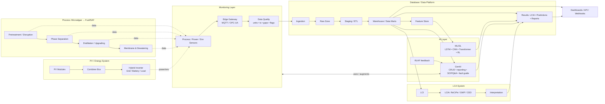

# ESG-Oriented-Microalgae-PV-LCA-System-for-Renewable-Biofuel-includes-GenAI

 
 
 
 
 
 
 
 

## System Overview

整合 **Microalgae Process**、**PV/Energy System**、**Life Cycle Assessment (LCA) System**、**Database Platform** 與 **GenAI System**的系統。

- **Process**：從微藻到生質燃油和副產品的過程。  
- **PV System**：基礎設施供電，同時進行能耗監控管理。  
- **LCA System**：評估Process與PV system的流程對生態環境、人體健康和資源的影響。  
- **Database**：蒐集Process與PV system資料，管理所有模型的狀態、數值資料、盤查紀錄與結果等，進行處理後，作為ML/DL的資料來源，LCA system 也會使用此資料進行評估。  
- **GenAI System**：系統連接所有層，可查看每層的狀態，將LCA system的結果、PV system的異常等問題轉換為自然語言進行解釋、報告生成與故障診斷，甚至用於所有系統的操作教學與維修指導。  

# System Architecture Details

## GenAI System

**功能 (Functions)**  
- CRUD 查詢：自然語言轉 SQL、查表或繪圖。  
- 報告生成：結構化 LCA / 能耗 報告。  
- SOP/Q&A：透過 RAG、VRAG 等查詢標準與手冊。  
- 故障導引：診斷 + 維修步驟（由監測資料觸發）。  
- 教學與培訓：將事件轉為一系列模組，任務進來後，觸發對應模組，編排出一系列教學。

**模型 (Models)**  
- 目前：LSTM、CNN。  
- 歸因：天氣、污染、維護紀錄 → 異常根因分析。  
- 未來：Transformer、RL、RLHF 最佳化。   

**資料介面 (Data Interface)**  
- **讀取**：`Warehouse`、`Feature Store`、`Results`。  
- **寫入**：`Results`（報告、解釋、任務）。  
- **雙向**：與 Monitoring 連動，處理警報與診斷。  

**KPI**  
- 預測準確度、解釋相關度、維護效率、培訓採用率。

---

## PV System

**Role**  
具備電池與電網介面的混合式太陽能供電系統。

**流程**  
PV 模組 → 匯流箱 → 混合逆變器 → 負載 / 電池 / 並網。

**量測資料 (Measurements)**  
串列電壓/電流、逆變器交流功率、電池 SoC、電網進/出功率、日照強度、模組溫度、環境各種狀態等。

**資料庫表 (Database Tables)**  
- pass
- 
**KPI**  
- Performance Ratio (PR)、PV 佔比 α、自用率、自給率、電池循環效率、逆變器效率。

---

# Life Cycle Assessment (LCA) of the Algal Oil Conversion System

## 1. Goal and Scope Definition
- **目標**：評估藻油生產路徑從培養到燃料轉換的環境、人體、資源的影響。  
- **系統邊界**：涵蓋破壁、分離、油脂精煉、副產物處理與水循環。  
- **功能單位**：1 MJ 燃料級藻油。  

## 2. Life Cycle Inventory (LCI)
資料收集：  
- **破壁**：電力、酵素/化學藥劑；細胞物質釋放。  
- **分相**：設備能耗；粗藻油與含水藻渣流量。  
- **油脂精煉**：蒸餾熱能需求；燃料油與雜質產出。  
- **藻渣/水處理**：膜分離與壓濾能耗；藻漿、固態藻渣、回用水產出。  
- **副產物流**：雜質、廢水與藻渣去向；回用比例與處理方式。  

資料來源：現場監測（能源、水、化學藥劑），以及背景資料庫（材料與能源生產）。

## 3. Life Cycle Impact Assessment (LCIA)
盤查資料轉換為環境衝擊指標：  
- **Climate change**：製程能耗引起的 CO₂ 排放。  
- **Resource depletion**：酵素、化學藥劑與水資源消耗。  
- **Ecotoxicity**：廢水與副產品排放影響。  
- **Energy return**：EROI / EPBT，輸入能耗與藻油可輸出能量比較。  

## 4. Interpretation
- **熱點分析**：辨識高能耗環節（如破壁、蒸餾）與高排放來源（如廢水處理、雜質）。  
- **敏感度分析**：測試水回用比例、能源來源（PV vs. 電網）的影響。  
- **不確定性分析**：Monte Carlo 模擬資料波動對結果的影響。  
- **改善建議**：降低破壁能耗、提升水回收率、利用藻渣作農業或能源資源。  

---

## Process (Microalgae → Fuel/SAF)

**Role**  

將微藻提煉為生質燃油，並回收副產品。

**輸入 / 輸出 (Inputs / Outputs)**  
- 輸入：微藻漿液、水、酵素/化學藥劑、熱能、電力。  
- 輸出：燃料級藻油（蒸餾餾分）、雜質（鹽、金屬、磷、氯）、藻渣、可回收水。  

**監測參數 (Monitored Parameters)**  
- 破壁：馬達負載、pH、導電度。  
- 分相：界面液位、流量。  
- 蒸餾：塔盤/填料溫度、塔壓、回流比、產品組成。  
- 膜分離/過濾：跨膜壓力、通量、濁度、泵功率。

**資料庫表 (Database Tables)**  
- Pass

**KPI**  
- 轉換率、比能耗 (kWh/MJ)、蒸餾能耗需求、膜通量、水回收率。\
  
---

## Database / Data Platform

**層級 (Layers)**  
- **Ingestion** – API、MQTT、OPC-UA。  
- **Raw zone** – 原始時序資料（僅追加）。  
- **Staging / ETL** – 單位正規化、時間對齊、異常標記。  
- **Warehouse / Data marts** – 星型架構 (fact/dim)。  
- **Feature Store** – 窗口特徵、滯後統計、環境資料關聯。  
- **Results** – LCIA、預測、報告。  
- **Access** – 檢視、API。  

**核心事實表 (Core Fact Tables)**  
- `fact_process_timeseries`, `fact_energy_timeseries`, `fact_material_flow`,  
  `fact_pv_allocation`, `fact_lci`, `fact_lcia`, `pred_pv_power`, `events_alarms`。  

**維度表 (Dimension Tables)**  
- `dim_equipment`, `dim_point`, `dim_process_step`, `dim_emission_factor`, `dim_method`。

---

# Microalgae Oil Conversion and By-product Processing

## Pretreatment & Cell Disruption
微藻經酵素處理或機械破壁，打破細胞壁，釋放細胞內油脂與可溶性有機物，形成後續分離的原料。

## Primary Separation
透過分相槽，將混合液分為 **Crude Algal Oil** 與 **Aqueous Residue**。  
此步驟為後續精煉與副產品回收奠定基礎。

## Algal Oil Refinement
粗藻油進入蒸餾塔，分離為 **Fuel-grade Algal Oil** 與雜質。  
- **Fuel-grade Algal Oil** 可用於生質柴油或作為催化升級前驅物。  
- **雜質** 分開收集，以便處理或再利用。  

## Residue and Water Treatment
- 含水藻渣經 **管式/錯流膜分離**，濃縮為藻漿液。  
- 再經 **板框壓濾**，去除多餘水分，得到可用於飼料/肥料/發酵的固態藻渣。  
- 同時產出 **可回用水**，部分回流藻池，形成閉環循環。  

## Resource Recovery & Circular Utilization
- **主產品**：Fuel-grade Algal Oil（再生能源）。  
- **副產品**：藻渣（農業/工業用途）、雜質（副流管理）、回用水（回流藻池）。
- 
---
